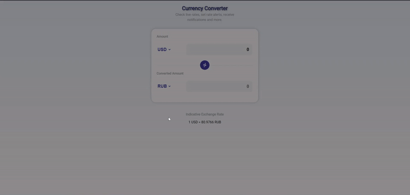

# 💱 Currency Converter

Project: Simple JavaScript currency converter using API.

## 🚀 Features

- Real-time currency conversion
- Conversion of popular currencies (USD, EUR, RUB, etc.)
- Clean minimalist interface
- Responsive design (works on mobile)
- No backend required (pure frontend JS)
- Keyboard-friendly navigation
- Quick currency swap functionality

## 🛠️ Technologies

- Vanilla JavaScript (ES6+)
- Fetch API for data retrieval
- CSS3 Flexbox/Grid for layout
- Mobile-first responsive design
- Web Accessibility (WAI-ARIA) compliant

## 🌍 How It Works

Client inputs:
- Source currency
- Target currency
- Amount

The system then:
- Makes a request to a secured Node.js server (where the API key is stored)
- The server forwards the request to [ExchangeRate-API](https://www.exchangerate-api.com/)

## 🖥️ Usage Example

## 📌 Important Notes

Currently using direct API calls with environment variables for key protection. Future plans include implementing a proxy service for additional security.

---

Author: [@khusainovilas](https://github.com/khusainovilas)